# Angular Planner

Полноценный тоду-менеджер на Angular 22 с авторизацией, папками, поиском и модальным редактированием.

## Стек

- Angular 22 (Signals, Standalone Components)
- TypeScript 6
- pnpm
- SCSS
- localStorage для персистентности

## Запуск

```bash
pnpm install
pnpm start
```

Откроется на `http://localhost:4200`

## Тестовые аккаунты

| Email | Пароль | Роль |
|-------|--------|------|
| `admin@test.com` | `123456` | Администратор |
| `user@test.com` | `qwerty` | Пользователь |

## Функционал

### Авторизация
Липовая авторизация через Angular Guard и Interceptor. Токен хранится в localStorage, добавляется к HTTP-запросам через `authInterceptor`.

### Управление задачами
- Добавление задач в выбранные папки
- Редактирование через модальное окно (название + перенос в другую папку)
- Отметка выполненных задач
- Удаление задач
- Поиск по названию

### Управление папками
- Создание папок с выбором цвета
- Редактирование названия и цвета
- Удаление папок (вместе с задачами)
- Счётчик задач в каждой папке

### Нотификации
Всплывающие уведомления при каждом действии: добавлении, удалении, редактировании, перемещении задач и папок.

## Архитектура

```
src/app/
├── auth/                    # Сервис авторизации
│   └── auth.service.ts
├── guards/                  # Route guards
│   └── auth.guard.ts        # authGuard + guestGuard
├── interceptors/            # HTTP interceptors
│   └── auth.interceptor.ts  # Добавляет Bearer токен
├── models/
│   └── todo.model.ts        # Интерфейсы Todo, Folder
├── services/
│   └── todo.service.ts      # Управление состоянием (Signals)
├── components/
│   ├── sidebar/             # Боковая панель папок
│   ├── todo-list/           # Список задач + модалка
│   ├── todo-item/           # Элемент задачи
│   ├── add-todo/            # Форма добавления
│   ├── search-bar/          # Поиск
│   ├── modal/               # Модальное окно редактирования
│   └── notif/               # Система нотификаций
└── pages/
    ├── login/               # Страница входа
    └── home/                # Главная страница
```

## Скриншоты

### Страница входа

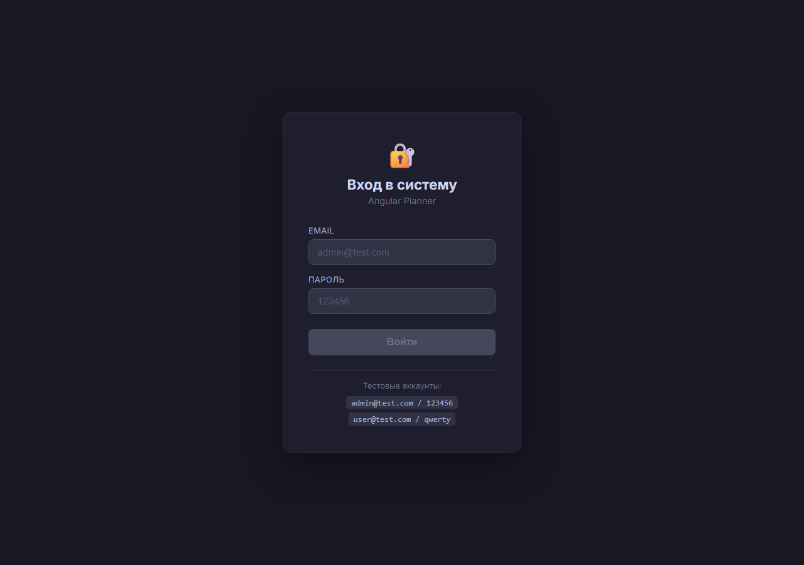

### Заполненная форма логина

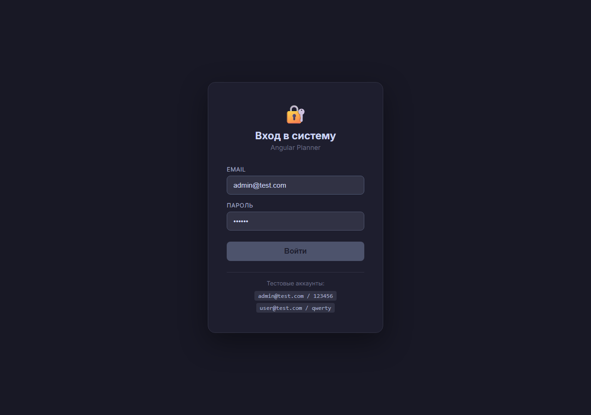

### Главная страница

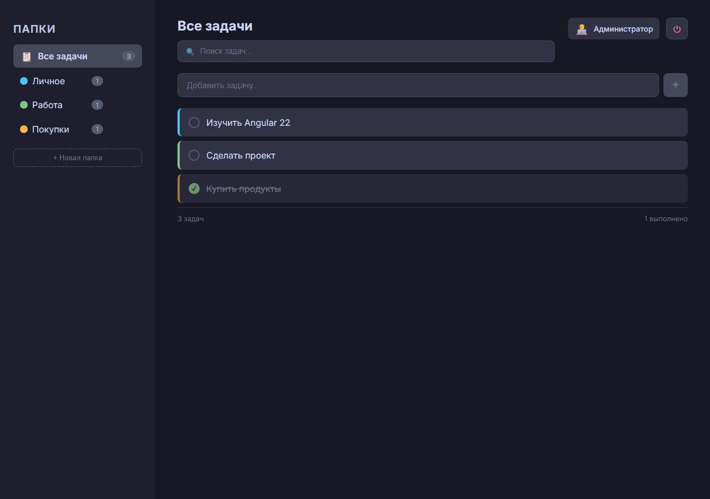

### Выбранная папка

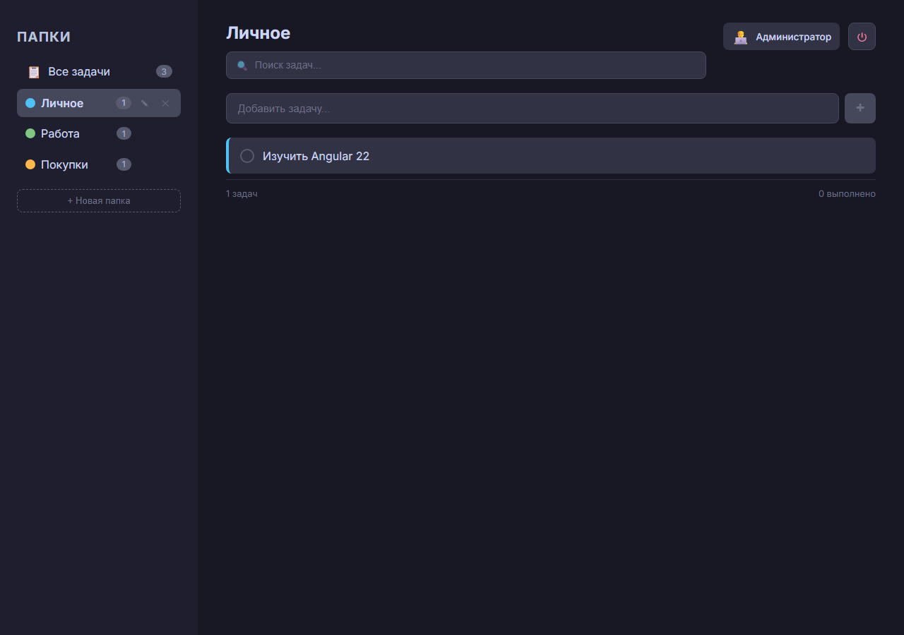

### Добавление задачи

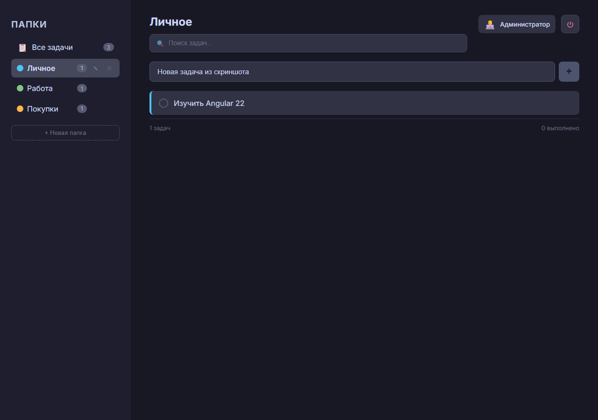

### Задача добавлена

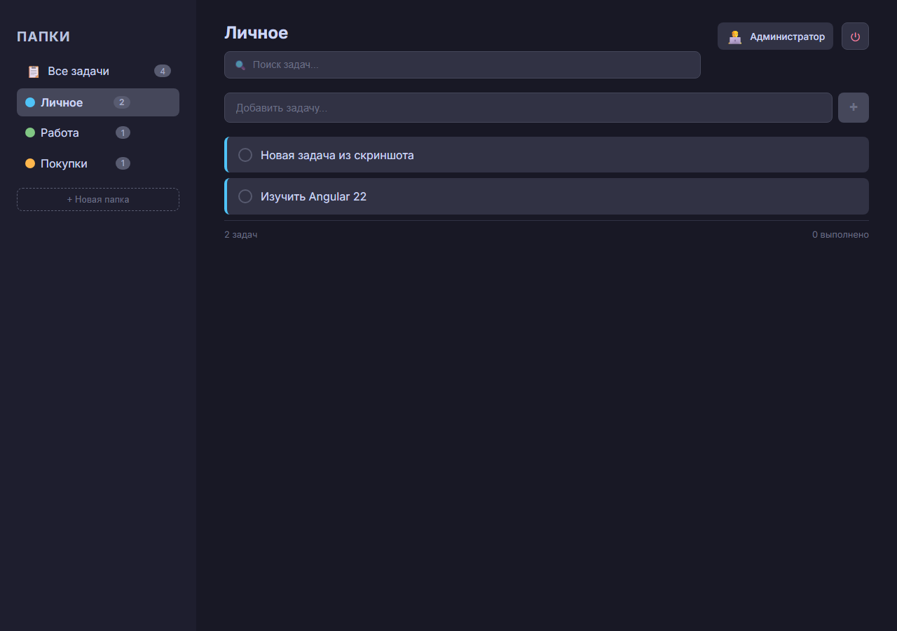

### Поиск задач

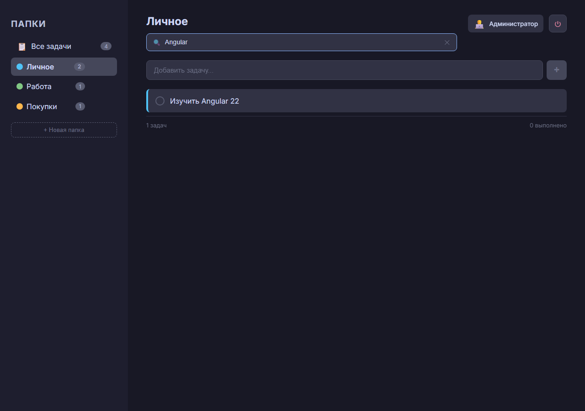

### Задача выполнена

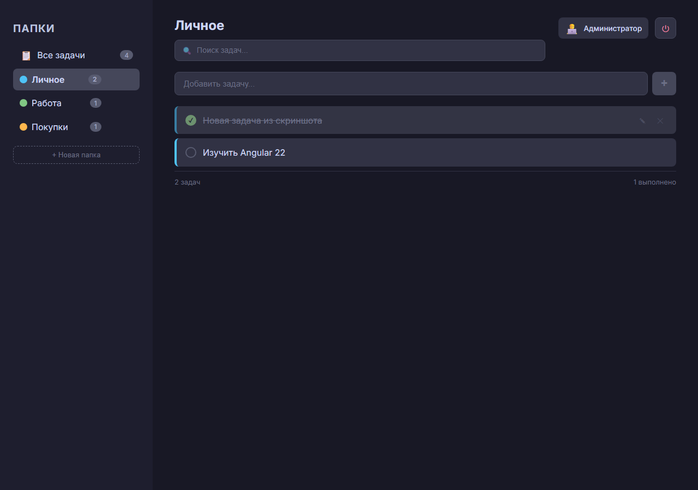

### Модальное окно редактирования

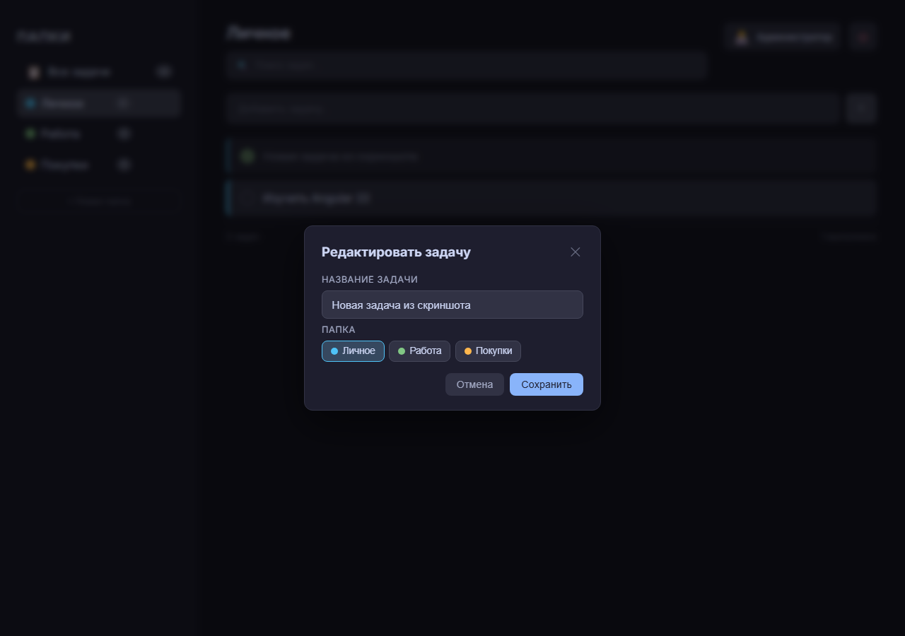

### Создание папки

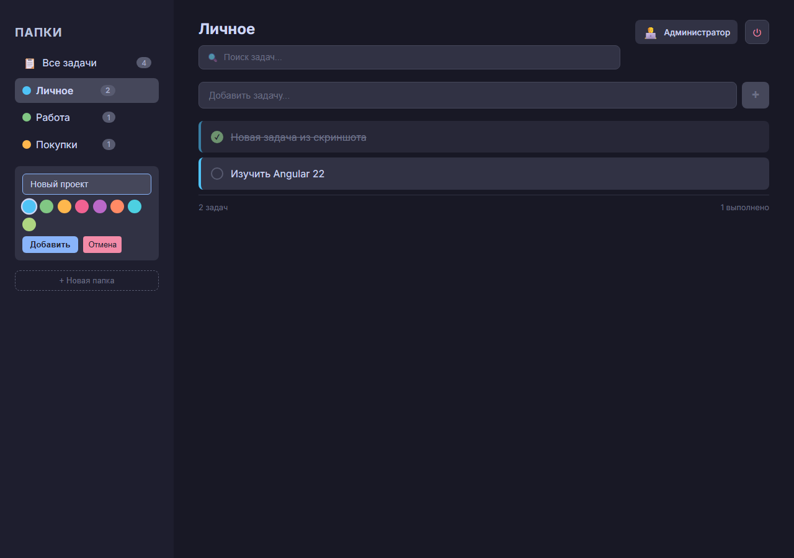

### Папка создана

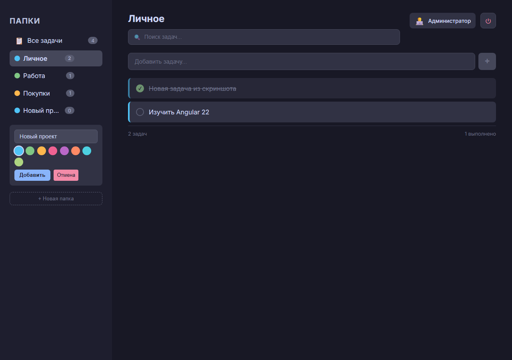

### Полный вид приложения


